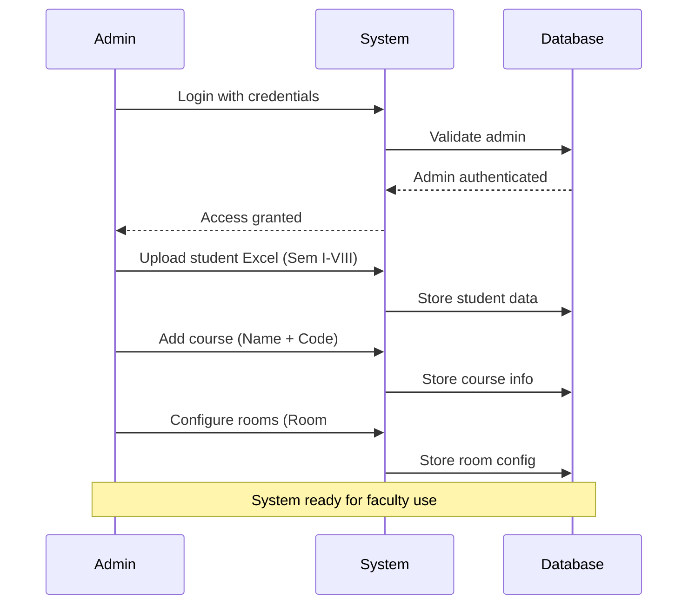
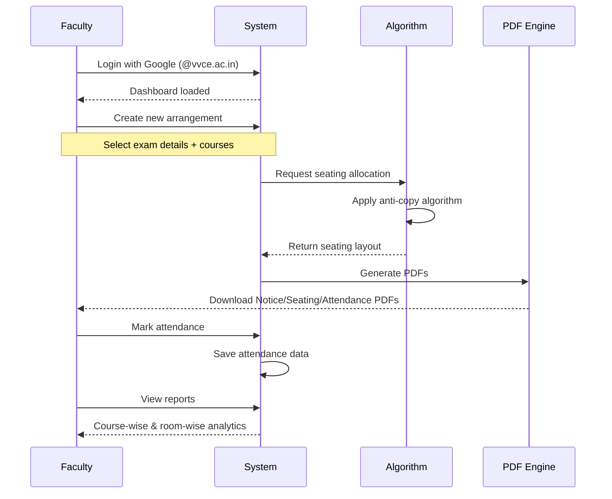

<div align="center">

# 🎓 AIML Examination Seat Allotment System

### *Smart. Automated. Anti-Copy.*

[](https://seating-dak2.onrender.com/)
[](https://nodejs.org/)
[](https://www.mongodb.com/)
[](LICENSE)

**A powerful web-based system for the Department of Artificial Intelligence & Machine Learning (AIML) at VVCE Mysuru**

[✨ Features](#-features) • [🚀 Quick Start](#-quick-start) • [📖 Documentation](#-documentation) • [🛠️ Tech Stack](#️-tech-stack)

---

</div>


---

## ✨ Features

<table>
<tr>
<td width="50%">

### 🔐 **Dual Authentication**
- ✅ Google OAuth 2.0 for faculty
- ✅ Custom admin credentials
- ✅ Session-based security
- ✅ Restricted to @vvce.ac.in accounts

</td>
<td width="50%">

### 🧠 **Smart Seating Algorithm**
- ✅ USN order preservation
- ✅ Anti-copy pattern (ABA/BAB)
- ✅ Room alternation
- ✅ Automatic overflow handling

</td>
</tr>
<tr>
<td width="50%">

### 📂 **Data Management**
- ✅ Excel/CSV upload support
- ✅ Semester-wise student lists
- ✅ Course catalog management
- ✅ Room configuration

</td>
<td width="50%">

### 📄 **PDF Generation**
- ✅ Seating layout PDF
- ✅ Attendance sheet PDF
- ✅ Notice board summary PDF
- ✅ One-click download

</td>
</tr>
</table>


---

## 🎯 How It Works

```mermaid
graph LR
    A[👤 Admin Login] --> B[📤 Upload Students]
    B --> C[➕ Add Courses]
    C --> D[🏛️ Configure Rooms]
    D --> E[🎓 Faculty Login]
    E --> F[🆕 Create Arrangement]
    F --> G[🧠 Smart Algorithm]
    G --> H[🪑 Generate Seating]
    H --> I[📄 Download PDFs]
    I --> J[✅ Mark Attendance]
    J --> K[📊 View Reports]
```



---

## 🪑 Anti-Copy Seating Logic

The system implements a **sophisticated anti-plagiarism algorithm**:

<div align="center">

### 🏢 Room Alternation Pattern

| Room | Pattern | Visual Layout |
|------|---------|---------------|
| **Room 1** | Starts ABA | `IV-VI-IV` → `VI-IV-VI` → `IV-VI-IV` |
| **Room 2** | Starts BAB | `VI-IV-VI` → `IV-VI-IV` → `VI-IV-VI` |
| **Room 3** | Starts ABA | `IV-VI-IV` → `VI-IV-VI` → `IV-VI-IV` |

</div>

### 📐 Algorithm Rules:

1. **Global Identity**: Batch groups (IV, VI) get fixed identities (A, B) at start
2. **3-Group Mode**: When 3+ batches → `ABC ABC ABC` pattern
3. **2-Group Mode**: When 2 batches → `ABA/BAB` alternating rows
4. **Row Alternation**: Within room, rows switch patterns
5. **Empty Seats**: Graceful handling when batches run out


---

## 🚀 Quick Start

### Prerequisites

- **Node.js** >= 18.0.0
- **MongoDB Atlas** account (free tier works!)
- **Google Cloud Console** project (for OAuth)

### 1️⃣ Clone Repository

```bash
git clone https://github.com/Nagendraas612/Seating.git
cd Seating
```

### 2️⃣ Install Dependencies

```bash
cd backend
npm install
```

### 3️⃣ Configure Environment Variables

Create `backend/.env` file:

```env
# Server Configuration
PORT=5000
NODE_ENV=development

# MongoDB
MONGO_URI=your_mongodb_connection_string

# Session Secret (generate with: node -e "console.log(require('crypto').randomBytes(32).toString('hex'))")
SESSION_SECRET=your_super_secret_key_here

# Google OAuth
GOOGLE_CLIENT_ID=your_google_client_id
GOOGLE_CLIENT_SECRET=your_google_client_secret
GOOGLE_CALLBACK_URL=http://localhost:5000/auth/google/callback

# Frontend URL
FRONTEND_URL=http://localhost:5000
```


### 4️⃣ Set Up Google OAuth

1. Go to [Google Cloud Console](https://console.cloud.google.com/)
2. Create a new project or select existing
3. Enable **Google+ API**
4. Create **OAuth 2.0 Client ID** credentials
5. Add authorized redirect URI: `http://localhost:5000/auth/google/callback`
6. Copy Client ID and Client Secret to `.env`

### 5️⃣ Set Up MongoDB Atlas

1. Sign up at [MongoDB Atlas](https://www.mongodb.com/cloud/atlas)
2. Create a free cluster
3. Create database user
4. Whitelist your IP (or use 0.0.0.0/0 for development)
5. Get connection string and add to `.env`

### 6️⃣ Run the Application

```bash
# Development mode (with auto-reload)
npm run dev

# Production mode
npm start
```

### 7️⃣ Access the Application

Open your browser and navigate to:
```
http://localhost:5000
```


---

## 📖 Documentation

### 📁 Project Structure

```
Seating/
├── 📂 backend/
│   ├── 📂 assets/          # Logo and images for PDFs
│   ├── 📄 server.js        # Main server file
│   ├── 📄 package.json     # Backend dependencies
│   └── 📄 .env             # Environment variables (gitignored)
├── 📂 frontend/
│   ├── 📄 index.html       # Main HTML file
│   ├── 📄 script.js        # Frontend logic
│   ├── 📄 style.css        # Styling
│   ├── 📄 manifest.json    # PWA manifest
│   └── 📄 sw.js            # Service worker
└── 📄 README.md            # You are here!
```

### 🔑 First-Time Setup

#### Create First Admin Account

The system allows creating the **first admin account** without authentication:

1. Start the server
2. Login screen → Click "🔐 Admin Access"
3. Enter username and password
4. Click "Sign In as Admin"
5. If no admin exists, account will be created automatically

> ⚠️ **Security Note**: After creating the first admin, subsequent admin accounts can only be created by logged-in admins.


### 👨‍💼 Admin Workflow



### 👨‍🏫 Faculty Workflow




---

## 🛠️ Tech Stack

<div align="center">

### **Frontend**
[](https://developer.mozilla.org/en-US/docs/Web/HTML)
[](https://developer.mozilla.org/en-US/docs/Web/CSS)
[](https://developer.mozilla.org/en-US/docs/Web/JavaScript)

### **Backend**
[](https://nodejs.org/)
[](https://expressjs.com/)

### **Database**
[](https://www.mongodb.com/)
[](https://www.mongodb.com/cloud/atlas)

### **Authentication**
[](http://www.passportjs.org/)
[](https://developers.google.com/identity/protocols/oauth2)

</div>


### 📦 Core Dependencies

| Package | Version | Purpose |
|---------|---------|---------|
| `express` | ^4.18.2 | Web framework |
| `mongoose` | ^8.0.3 | MongoDB ODM |
| `passport` | ^0.6.0 | Authentication middleware |
| `passport-google-oauth20` | ^2.0.0 | Google OAuth strategy |
| `bcryptjs` | ^3.0.3 | Password hashing |
| `pdfkit` | ^0.14.0 | PDF generation |
| `xlsx` | ^0.18.5 | Excel file parsing |
| `multer` | ^1.4.5-lts.1 | File upload handling |
| `express-session` | ^1.17.3 | Session management |
| `connect-mongo` | ^5.1.0 | MongoDB session store |
| `helmet` | ^8.0.0 | Security headers |
| `express-rate-limit` | ^7.5.0 | Rate limiting |
| `cors` | ^2.8.5 | CORS middleware |

---

## 🔒 Security Features

- ✅ **Session Management**: Secure, HTTP-only cookies with 8-hour expiration
- ✅ **Password Hashing**: Bcrypt with 12 salt rounds
- ✅ **Rate Limiting**: 100 requests/15min for API, 20 requests/15min for auth
- ✅ **Helmet.js**: Sets security HTTP headers
- ✅ **CORS Protection**: Restricted to configured frontend URL
- ✅ **File Upload Validation**: Type and size restrictions
- ✅ **Input Sanitization**: MongoDB injection prevention
- ✅ **HTTPS Enforcement**: Secure cookies in production


---

## 📊 Database Schema

### Collections

```javascript
// 1. Rooms
{
  roomNo: String,        // e.g., "201", "301A"
  benches: Number,       // Number of benches in room
  enabled: Boolean       // Active/Inactive status
}

// 2. StudentData (per semester)
{
  semester: String,      // "I", "II", ..., "VIII"
  students: [
    {
      name: String,
      usn: String       // e.g., "4VV24CI001"
    }
  ],
  uploadedAt: Date
}

// 3. CourseData
{
  semester: String,
  courseName: String,   // e.g., "Data Structures"
  courseCode: String,   // e.g., "22CS31"
  createdAt: Date
}

// 4. Allocation (seating arrangement)
{
  examName: String,
  date: String,
  session: String,      // "Morning" / "Afternoon"
  courses: [...],       // Course details
  rooms: [...],         // Seating layout
  summary: [...],       // Notice board data
  attendanceByRoom: [...],
  attendance: [...]     // Marked attendance
}

// 5. AdminUser
{
  username: String,
  passwordHash: String,
  createdAt: Date
}
```


---

## 🌐 Deployment

### Deploy to Render (Recommended)

1. **Create Render Account**: [render.com](https://render.com)

2. **Create New Web Service**:
   - Connect your GitHub repository
   - Build command: `cd backend && npm install`
   - Start command: `node backend/server.js`

3. **Set Environment Variables**:
   ```
   NODE_ENV=production
   PORT=5000
   MONGO_URI=your_mongodb_atlas_uri
   SESSION_SECRET=your_production_secret
   GOOGLE_CLIENT_ID=your_client_id
   GOOGLE_CLIENT_SECRET=your_client_secret
   GOOGLE_CALLBACK_URL=https://your-app.onrender.com/auth/google/callback
   FRONTEND_URL=https://your-app.onrender.com
   ```

4. **Update Google OAuth Settings**:
   - Add production callback URL to authorized redirect URIs
   - `https://your-app.onrender.com/auth/google/callback`

5. **Deploy**! 🚀

### Other Deployment Options

- **Railway**: Similar to Render, easy setup
- **Heroku**: Classic PaaS option
- **DigitalOcean**: App Platform or Droplet
- **AWS**: EC2 or Elastic Beanstalk
- **Vercel**: Frontend + serverless functions


---

## 🧪 Testing Locally

### Test Data Preparation

1. **Create Student Excel File**:
   ```
   | Name              | USN        |
   |-------------------|------------|
   | John Doe          | 4VV24CI001 |
   | Jane Smith        | 4VV24CI002 |
   | Alice Johnson     | 4VV24CI003 |
   ```

2. **Upload via Admin Panel**:
   - Login as admin
   - Navigate to "Student Data"
   - Select semester
   - Upload Excel/CSV file

3. **Add Courses**:
   - Go to "Course Data"
   - Enter: Semester, Course Name, Course Code
   - Click "Add Course"

4. **Configure Rooms**:
   - Navigate to "Rooms"
   - Add: Room Number (e.g., "201"), Benches (e.g., 18)
   - Click "Add Room"

5. **Generate Seating**:
   - Login as faculty (Google)
   - Click "New Arrangement"
   - Fill exam details and select courses
   - Click "Generate Seating Arrangement"

### Expected Output
- ✅ Seating layout with ABA/BAB patterns
- ✅ Notice board PDF with room summaries
- ✅ Attendance sheet PDF with student lists


---

## 🎨 UI/UX Highlights

### Design Philosophy
- **Institutional Theme**: Dark sidebar with clean white content area
- **Professional Fonts**: Inter (UI), JetBrains Mono (codes/USNs)
- **Responsive**: Mobile-first design with bottom navigation
- **Accessibility**: ARIA labels, focus states, keyboard navigation
- **Loading States**: Skeleton screens for better UX
- **Animations**: Subtle transitions for page changes

### Color Palette

```css
--accent: #2563eb          /* Primary blue */
--success: #16a34a         /* Success green */
--danger: #dc2626          /* Error red */
--warning: #d97706         /* Warning orange */
--sidebar-bg: #0d1117      /* Dark sidebar */
--bg-card: #ffffff         /* Card background */
```

### Typography

- **Headings**: Inter (sans-serif)
- **Body**: Inter (sans-serif)
- **Code/USN**: JetBrains Mono (monospace)

---

## 📱 Mobile Support

The application is **fully responsive** with:

- ✅ Adaptive layouts for all screen sizes
- ✅ Touch-friendly buttons and controls
- ✅ Mobile bottom navigation bar
- ✅ Optimized table displays
- ✅ Hamburger menu for sidebar
- ✅ Swipe gestures support


---

## 🔮 Future Roadmap

### Phase 1: Enhanced Features
- [ ] 🎯 **Drag & Drop Seating Editor**: Manual adjustments to generated layouts
- [ ] 📊 **Advanced Analytics**: Attendance patterns, trend analysis
- [ ] 🎫 **Hall Ticket Integration**: Auto-generate admit cards
- [ ] 📧 **Email Notifications**: Automated alerts to students

### Phase 2: Mobile & Automation
- [ ] 📱 **Native Mobile App**: React Native/Flutter version
- [ ] 📸 **QR Code Attendance**: Quick check-in with QR scanning
- [ ] 🤖 **Bulk Exam Scheduling**: Plan multiple exams at once
- [ ] 🔄 **Auto-Sync**: Real-time updates across devices

### Phase 3: AI & Intelligence
- [ ] 🧠 **AI-Based Seating**: ML-powered optimal arrangements
- [ ] 📈 **Predictive Analytics**: Forecast attendance patterns
- [ ] 🎭 **Behavior Analysis**: Detect suspicious attendance trends
- [ ] 🌙 **Dark Mode**: Alternative theme option

### Phase 4: Enterprise Features
- [ ] 🏢 **Multi-Department Support**: Scale to entire institution
- [ ] 👥 **Role-Based Access Control**: Granular permissions
- [ ] 📊 **Excel Export**: Download reports in spreadsheet format
- [ ] 🔗 **API Integration**: Connect with university systems


---

## ❓ FAQ

<details>
<summary><b>Q: Can I use this for departments other than AIML?</b></summary>
<br>
A: Absolutely! The system is designed to be department-agnostic. Just update the branding (logos, name) and configure your rooms/courses accordingly.
</details>

<details>
<summary><b>Q: What USN format is supported?</b></summary>
<br>
A: The system expects the format: <code>[digit][2 letters][2 digits - BATCH YEAR][2 letters - BRANCH][3 digits]</code>
<br>Example: <code>4VV24CI001</code> → Batch 2024, CI branch, Roll 001
</details>

<details>
<summary><b>Q: Can I manually edit seating after generation?</b></summary>
<br>
A: Currently, you need to regenerate the arrangement. Manual editing is on the roadmap for Phase 1.
</details>

<details>
<summary><b>Q: How many students can the system handle?</b></summary>
<br>
A: The system can easily handle 1000+ students. Performance depends on your MongoDB Atlas tier and server resources.
</details>

<details>
<summary><b>Q: Is the attendance data secure?</b></summary>
<br>
A: Yes! All data is encrypted in transit (HTTPS), stored securely in MongoDB, and access is restricted to authenticated users only.
</details>

<details>
<summary><b>Q: Can I deploy this for free?</b></summary>
<br>
A: Yes! Use Render's free tier + MongoDB Atlas free tier. Note: Free tier has cold start delays (~1min) after inactivity.
</details>


---

## 🐛 Troubleshooting

### Common Issues

#### 1. "Cannot connect to MongoDB"
```bash
# Check your MONGO_URI in .env
# Ensure IP is whitelisted in MongoDB Atlas
# Verify network connection
```

#### 2. "Google OAuth Error"
```bash
# Verify GOOGLE_CLIENT_ID and GOOGLE_CLIENT_SECRET
# Check callback URL matches Google Console settings
# Ensure Google+ API is enabled
```

#### 3. "Session expired immediately"
```bash
# Check SESSION_SECRET is set in .env
# Verify cookie settings (secure: false for localhost)
# Clear browser cookies and try again
```

#### 4. "Excel upload fails"
```bash
# Ensure columns are named "Name" and "USN"
# Check file format (.xlsx, .xls, .csv only)
# Verify file size < 10MB
```

#### 5. "PDF generation error"
```bash
# Check backend/assets/ folder has logo.png, aiml.jpg, vvce.jpg
# Verify PDFKit is installed correctly
# Check console logs for specific error
```


---

## 🤝 Contributing

We welcome contributions! Here's how you can help:

### 🐛 Report Bugs
Open an issue with:
- Clear title and description
- Steps to reproduce
- Expected vs actual behavior
- Screenshots (if applicable)

### 💡 Suggest Features
- Check existing issues first
- Describe the feature and use case
- Explain why it would benefit users

### 🔧 Submit Pull Requests

1. Fork the repository
2. Create feature branch: `git checkout -b feature/amazing-feature`
3. Make your changes
4. Test thoroughly
5. Commit: `git commit -m 'Add amazing feature'`
6. Push: `git push origin feature/amazing-feature`
7. Open a Pull Request

### 📝 Code Style
- Follow existing code conventions
- Add comments for complex logic
- Use meaningful variable names
- Keep functions small and focused

---

## 📜 License

This project is developed for **educational and institutional use**. 

© 2024 AIML Department, VVCE Mysuru. All rights reserved.


---

## 👥 Team

<div align="center">

### 🎓 Developed By

<table>
<tr>
<td align="center">
<br>
<b>P.G Ayush Rai</b><br>
<sub>Developer</sub>
</td>
<td align="center">
<br>
<b>Nagasiri Mourya</b><br>
<sub>Developer</sub>
</td>
<td align="center">
<br>
<b>Nagaveni H.S</b><br>
<sub>Developer</sub>
</td>
<td align="center">
<br>
<b>Nagendra A.S (Sanjay)</b><br>
<sub>Lead Developer</sub>
</td>
</tr>
</table>

### 🏛️ Institution
**Vidyavardhaka College of Engineering (VVCE)**  
Department of Artificial Intelligence & Machine Learning  
Mysuru, Karnataka, India

</div>


---

## 📞 Support & Contact

### 🌐 Links

- **Live Demo**: [https://seating-dak2.onrender.com](https://seating-dak2.onrender.com)
- **GitHub Repository**: [https://github.com/Nagendraas612/Seating](https://github.com/Nagendraas612/Seating)
- **Documentation**: [README.md](https://github.com/Nagendraas612/Seating#readme)
- **Issue Tracker**: [GitHub Issues](https://github.com/Nagendraas612/Seating/issues)

### 💬 Get Help

- **Email**: [Your institutional email]
- **Discord**: [Your Discord server]
- **Stack Overflow**: Tag `aiml-seating`

### 🙏 Acknowledgments

- VVCE Faculty for guidance and support
- MongoDB Atlas for free tier database hosting
- Render for free tier application hosting
- Google for OAuth authentication services
- All contributors and testers

---

<div align="center">

## ⭐ Star Us!

If this project helped you, please consider giving it a ⭐ on GitHub!

[](https://github.com/Nagendraas612/Seating)
[](https://github.com/Nagendraas612/Seating/fork)
[](https://github.com/Nagendraas612/Seating)


---

### 📊 Project Stats


---

Made with ❤️ by AIML Department, VVCE Mysuru

**"Automating Excellence, One Seat at a Time"**

</div>
